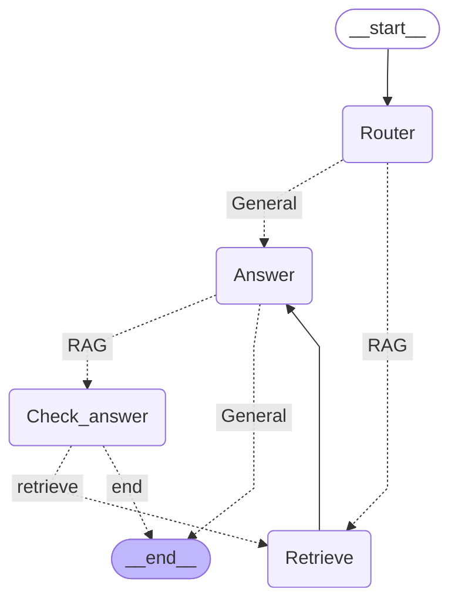

```mermaid
---
config:
  flowchart:
    curve: linear
---
graph TD;
	__start__([<p>__start__</p>]):::first
	Answer(Answer)
	Check_answer(Check_answer)
	Router(Router)
	Retrieve(Retrieve)
	__end__([<p>__end__</p>]):::last
	Answer -. &nbsp;RAG&nbsp; .-> Check_answer;
	Answer -. &nbsp;General&nbsp; .-> __end__;
	Check_answer -. &nbsp;retrieve&nbsp; .-> Retrieve;
	Check_answer -. &nbsp;end&nbsp; .-> __end__;
	Retrieve --> Answer;
	Router -. &nbsp;General&nbsp; .-> Answer;
	Router -. &nbsp;RAG&nbsp; .-> Retrieve;
	__start__ --> Router;
	classDef default fill:#f2f0ff,line-height:1.2
	classDef first fill-opacity:0
	classDef last fill:#bfb6fc

```